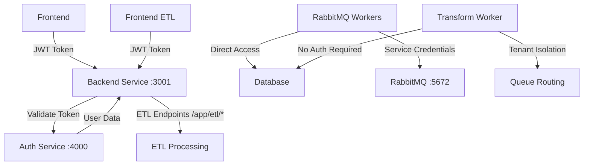

# ARCHITECTURE

**Pulse Platform System Architecture & Design**

This document provides a comprehensive overview of the Pulse Platform's architecture, including system topology, multi-tenancy design, database architecture, and deployment configurations.

## 🏗️ System Architecture Overview

### Five-Tier Microservices Architecture

Pulse Platform follows a modern microservices architecture with centralized authentication, comprehensive AI capabilities, and clear separation of concerns.

```
┌─────────────────────────────────────────────────────────────────┐
│                    Frontend Application                         │
│                   (React/TypeScript - Port 5173)               │
├─────────────────────────────────────────────────────────────────┤
│                                                                 │
│  📊 Executive Dashboards    🎨 Client Branding                  │
│  📈 DORA Metrics           🌙 Dark/Light Mode                   │
│  🔧 Admin Interface        📱 Responsive Design                 │
│  🤖 AI Features            🔍 Semantic Search                   │
│                                                                 │
└─────────────────────────────────────────────────────────────────┘
                    │                       │
                    ▼                       ▼
┌─────────────────┐              ┌─────────────────┐              ┌─────────────────┐
│  Backend        │              │  Frontend ETL   │              │  Auth Service   │
│  Service        │◄────────────►│  (React/TS)     │              │  (FastAPI)      │
│  (FastAPI)      │              │  Port: 3333     │              │  Port: 4000     │
│  Port: 3001     │              │                 │              │                 │
│                 │              │ • Job Cards     │              │ • JWT Tokens    │
│ • Authentication│              │ • WIT Mgmt      │              │ • User Auth     │
│ • User Mgmt     │              │ • Status Mgmt   │              │ • OKTA Ready    │
│ • Session Mgmt  │              │ • Integrations  │              │ • SSO Flow      │
│ • API Gateway   │              │ • Dark Mode     │              │ • Validation    │
│ • Client Mgmt   │              │ • Responsive    │              │                 │
│ • ML Monitoring │              │                 │              │                 │
│ • AI Operations │              │                 │              │                 │
│ • Flexible AI   │              │                 │              │                 │
│ • Embeddings    │              │                 │              │                 │
│ • Chat Agents   │              │                 │              │                 │
│ • Vector Ops    │              │                 │              │                 │
│ • JSON Routing  │              │                 │              │                 │
│ • RBAC & JWT    │              │                 │              │                 │
│ • ETL Endpoints │              │                 │              │                 │
│   /app/etl/*    │              │                 │              │                 │
└─────────────────┘              └─────────────────┘              └─────────────────┘
                    │                       │
                    └───────────────────────┼─────┐
                                           │     │
                    ┌──────────────────────┘     │
                    ▼                            ▼
┌─────────────────────────────────────┐    ┌─────────────────┐
│           Data Layer                │    │  ETL Service    │
│                                     │    │  (LEGACY)       │
│  🗄️ PostgreSQL Primary/Replica      │    │  Port: 8002     │
│  🔄 Redis Cache                     │    │                 │
│  🐰 RabbitMQ Queue                  │    │ ⚠️ DO NOT USE   │
│  🤖 Qdrant Vector Database          │    │ • Old Monolith  │
│  📁 File Storage                    │    │ • Jinja2 HTML   │
│                                     │    │ • Legacy Backup │
└─────────────────────────────────────┘    │ • Reference Only│
                                           │                 │
                                           └─────────────────┘
```

### Service Responsibilities

#### Frontend Application (Port 5173)
- **Technology**: React 18, TypeScript, Tailwind CSS, Vite
- **Purpose**: Executive dashboards and user interface

#### Backend Service (Port 3001)
- **Technology**: FastAPI, SQLAlchemy, Python 3.11+
- **Purpose**: Core business logic and API gateway
- **Responsibilities**: User authentication, RBAC, multi-tenant data isolation, AI operations, analytics, ETL endpoints

#### Frontend ETL (Port 3333)
- **Technology**: React, TypeScript, Tailwind CSS
- **Purpose**: ETL management interface

#### Auth Service (Port 4000)
- **Technology**: FastAPI, JWT
- **Purpose**: Centralized authentication with OAuth-like flow

## 🗄️ Database Architecture

### PostgreSQL Primary-Replica Setup

```
┌─────────────────┐    Async     ┌─────────────────┐
│  Primary DB     │─────────────►│  Replica DB     │
│  (Port 5432)    │ Replication  │  (Port 5433)    │
│                 │              │                 │
│ • Write Ops     │              │ • Read Ops      │
│ • Transactions  │              │ • Analytics     │
│ • Consistency   │              │ • Reporting     │
└─────────────────┘              └─────────────────┘
```

### Multi-Tenant Data Model

All tables include `tenant_id` for isolation with row-level security policies enforcing tenant boundaries.

### Vector Database Integration

```
┌─────────────────┐    Vector     ┌─────────────────┐
│  PostgreSQL     │   Embeddings  │  Qdrant Vector  │
│                 │─────────────►│  Database       │
│ • Structured    │              │                 │
│   Data          │              │ • Embeddings    │
│ • Metadata      │              │ • Similarity    │
│ • Relations     │              │ • Search        │
└─────────────────┘              └─────────────────┘
```

## 🔄 Data Flow Architecture

### ETL Data Pipeline

```
External APIs ──► Queue ──► Processing ──► Database ──► Vectorization ──► AI Search
     │             │           │             │              │              │
  Jira API      RabbitMQ   ETL Workers   PostgreSQL    Qdrant Vector   Semantic
  GitHub API    Messages   Background    Primary DB    Database        Search
  Custom APIs   Queuing    Processing    Replica DB    Embeddings      Results
```

### Authentication Flow

```
User Request ──► Auth Service ──► JWT Token ──► Backend Service ──► Database
     │               │               │               │                │
  Login Form     Validation      Token Issue     Permission Check   Data Access
  Credentials    OKTA/Local      Secure Cookie   RBAC Enforcement   Tenant Filter
```

### Service-to-Service Authentication



**Authentication Types:**
- **🌐 User Authentication**: Frontend → Backend → Auth Service (JWT validation)
- **🤖 System Authentication**: Workers → Database (direct system credentials)
- **🔧 Service-to-Service**: Backend ↔ Auth Service (HTTP token validation)

### Middleware & System Requests

The platform includes smart middleware that:
- **Skips JWT validation** for system endpoints (`/health`, `/docs`, `/static/*`)
- **Prevents startup errors** by not validating tokens for internal requests
- **Maintains security** for user-facing endpoints with proper JWT validation
- **Supports error suppression** for middleware to avoid log spam during startup

## 🏢 Multi-Tenancy Design

### Tenant Isolation Layers

#### 1. Database Level
- Row-Level Security with automatic tenant filtering
- Tenant-aware connection management

#### 2. Application Level
- JWT tokens include tenant context
- Automatic tenant scope enforcement
- Tenant-specific cache keys

#### 3. Infrastructure Level
- Tenant-specific logging and file storage
- Isolated monitoring metrics

## 🔧 Deployment Architecture

### Development Environment
```
Developer Machine
├── Frontend (npm run dev)
├── Backend (uvicorn --reload)
├── Frontend ETL (npm run dev)
├── Auth Service (uvicorn --reload)
└── Docker Compose (databases only)
```

### Production Environment
```
Load Balancer
├── Frontend Cluster (3 replicas)
├── Backend Cluster (3 replicas)
├── Frontend ETL Cluster (2 replicas)
├── Auth Service Cluster (2 replicas)
└── Database Cluster (Primary + Replica)
```

---

**This architecture provides enterprise-grade scalability, security, and maintainability while supporting rapid development and deployment.**
