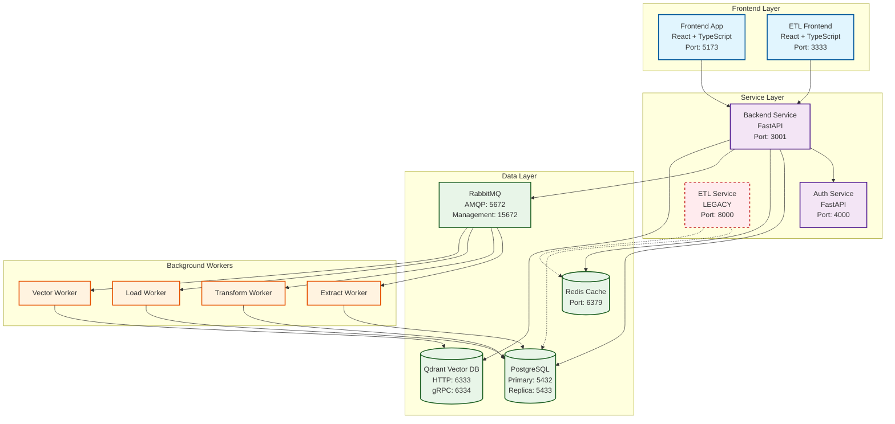
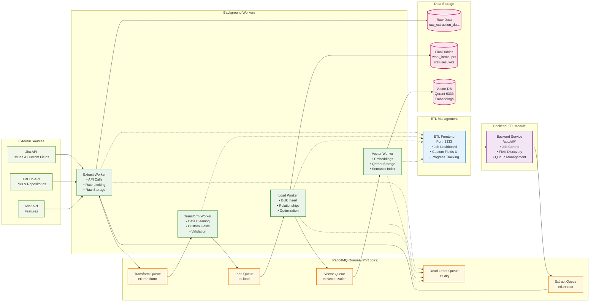
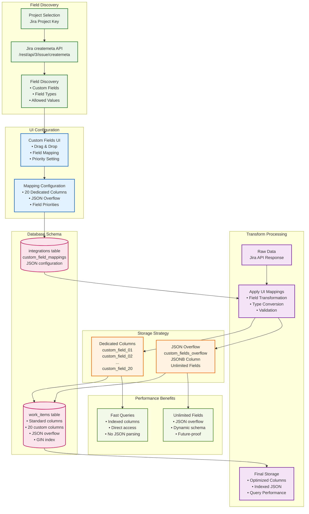
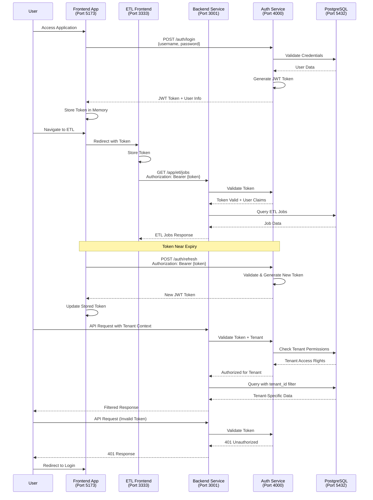
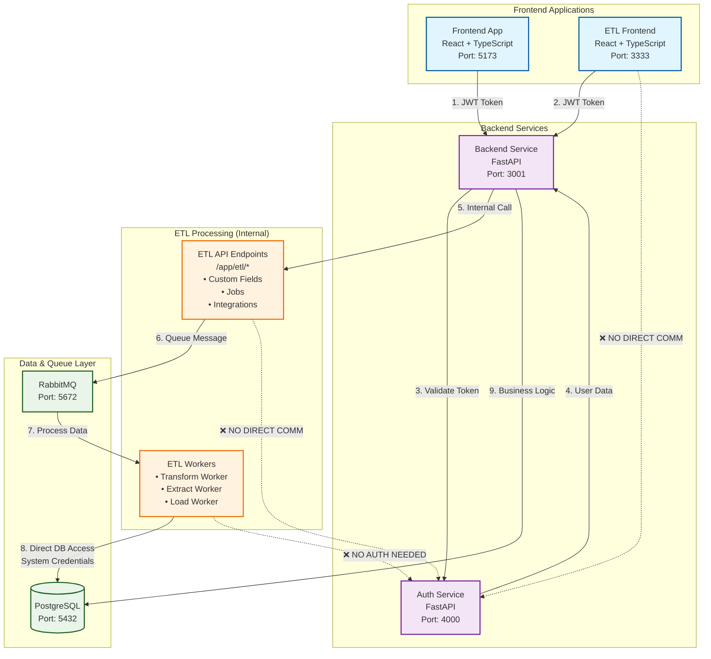
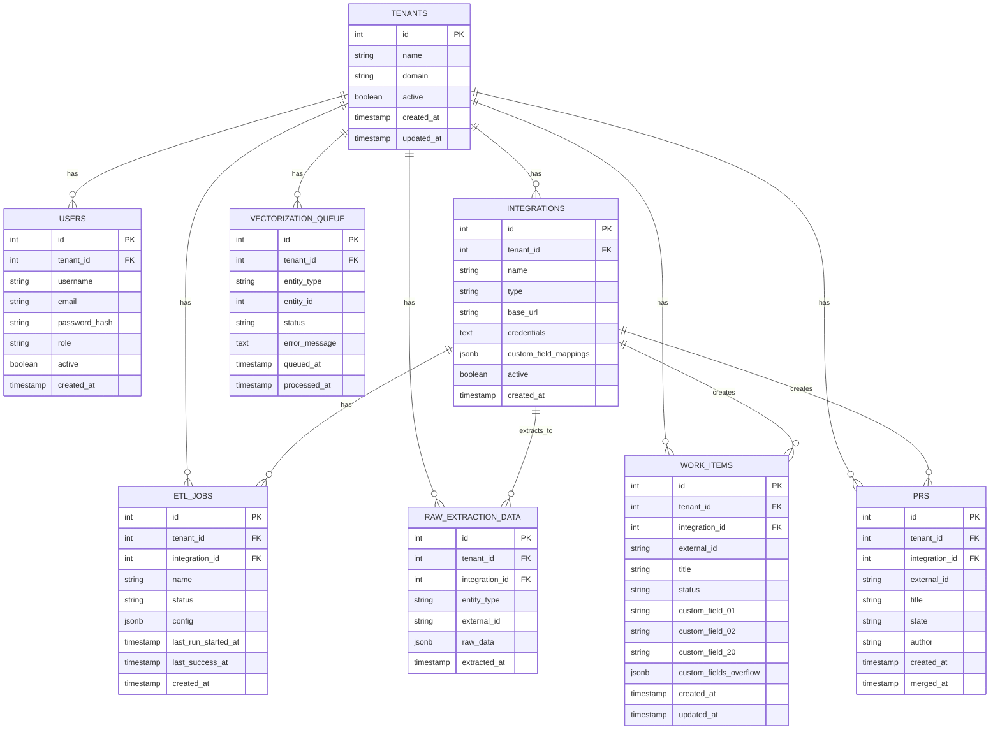
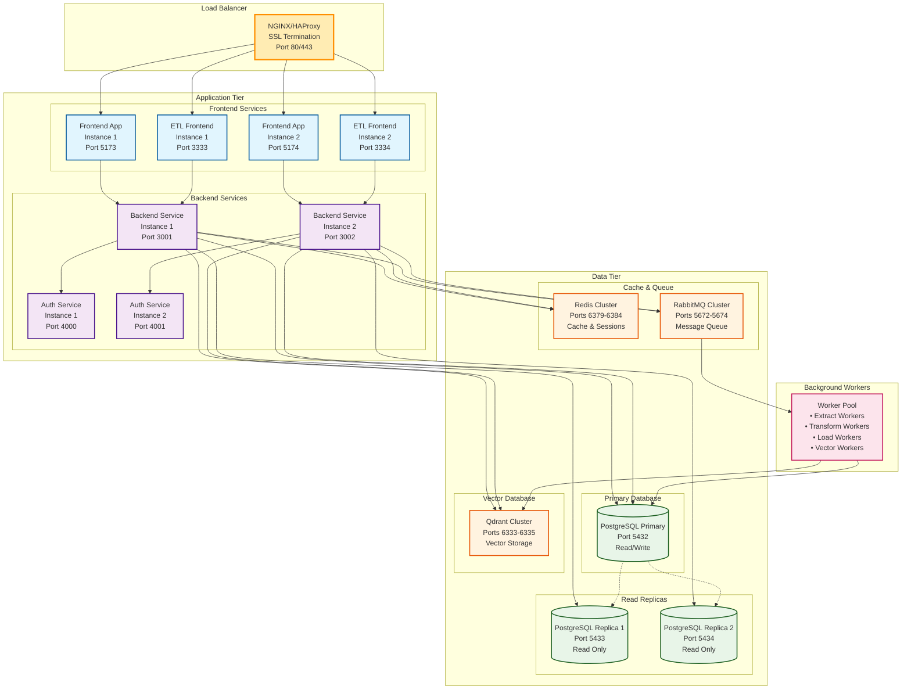

# Health Pulse Platform - Architecture Diagrams

This document contains comprehensive visual architecture diagrams for the Health Pulse platform using Mermaid syntax. These diagrams can be rendered in any Mermaid-compatible viewer or documentation system.

## 1. Complete Platform Architecture

## 2. ETL Queue-Based Processing Pipeline

## 3. Dynamic Custom Fields Management System

## 4. Authentication & Authorization Flow

## 4.1. Service-to-Service Authentication Flow

### Authentication Types Explained:

#### 🌐 **User Authentication (Interactive)**
- **Path**: Frontend → Backend Service → Auth Service
- **Purpose**: Validate user requests from UI applications
- **Token**: JWT in Authorization header
- **Flow**: `ETL Frontend → Backend /app/etl/* → Auth Service validation`

#### 🤖 **System Authentication (Workers)**
- **Path**: RabbitMQ Workers → Database (Direct)
- **Purpose**: Background processing without user context
- **Credentials**: System database credentials
- **No Auth Service**: Workers don't need user authentication

#### 🔧 **Internal Processing (No Auth)**
- **Path**: Backend Service → ETL API Endpoints (Internal)
- **Purpose**: Internal service communication
- **Security**: Same process, no network calls
- **Context**: User context passed through function calls

## 5. Database Schema Overview

## 6. Deployment Architecture

## How to Use These Diagrams

### Viewing Options
1. **GitHub/GitLab**: These platforms render Mermaid diagrams automatically
2. **VS Code**: Install Mermaid Preview extension
3. **Online Viewers**:
   - https://mermaid.live/
   - https://mermaid-js.github.io/mermaid-live-editor/
4. **Documentation Sites**: GitBook, Notion, Confluence support Mermaid

### Exporting
- **PNG/SVG**: Use mermaid.live or mermaid-cli
- **PDF**: Export from online viewers
- **Presentations**: Copy diagram code into presentation tools that support Mermaid

### Customization
- Modify colors by changing `classDef` definitions
- Add/remove components by editing the graph structure
- Update ports/endpoints as the system evolves

---

**File**: `docs/ARCHITECTURE_DIAGRAMS.md`
**Version**: 1.0.0
**Last Updated**: 2025-10-03
**Diagrams**: 6 comprehensive architecture diagrams
