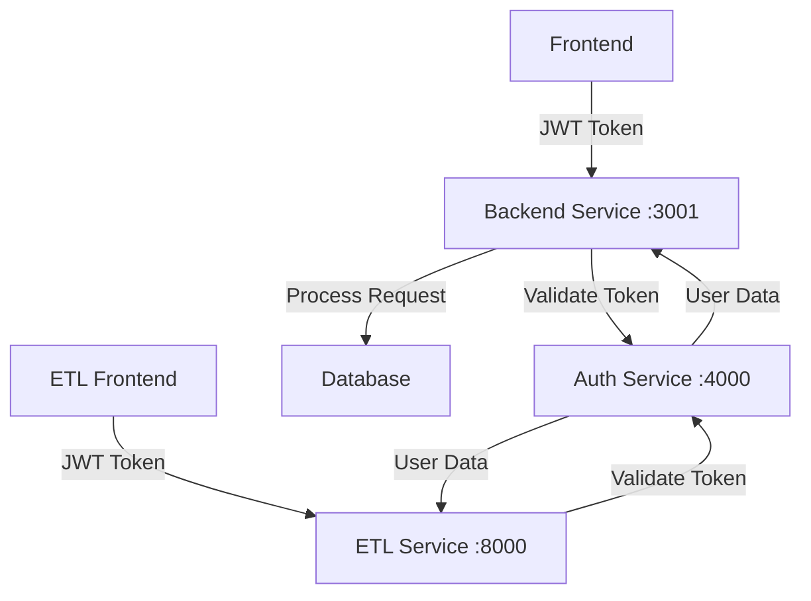
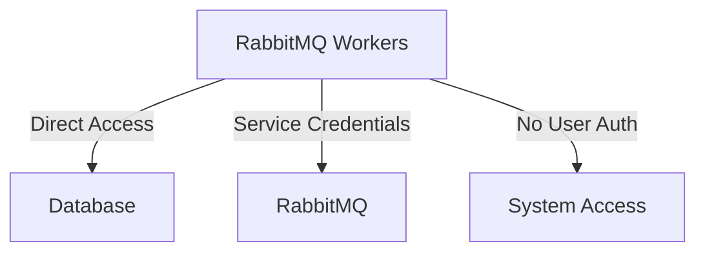

# SECURITY & AUTHENTICATION

**Comprehensive Security Architecture & Authentication System**

This document covers all security aspects of the Pulse Platform, including authentication mechanisms, role-based access control (RBAC), tenant isolation, and security best practices.

## 🔐 Centralized Authentication Architecture

### Overview

Pulse Platform features a **centralized authentication service** that provides OAuth-like authentication flow across all services. This architecture solves cross-domain authentication challenges and provides enterprise-grade SSO capabilities.

### Authentication Flow

```
Frontend (3000) ──┐
                  ├──→ Auth Service (4000) ──→ Backend Service (3001) ──→ Database
ETL Service (8000) ──┘
```

**Step-by-Step Process:**
1. User visits any service → Redirected to Auth Service if not authenticated
2. Auth Service validates credentials (via provider abstraction: local DB through backend or OKTA)
3. Auth Service issues the JWT and completes the flow
4. Services store the JWT and send it on subsequent requests
5. Services delegate JWT validation to the Auth Service (no local verification in backend)

### Benefits
- ✅ **Cross-Domain Authentication** - Works across different domains
- ✅ **Single Sign-On (SSO)** - Login once, access all services
- ✅ **OKTA Integration Ready** - Provider abstraction layer implemented
- ✅ **Centralized Session Management** - Logout affects all services
- ✅ **Security** - OAuth-like flow with proper token validation

### JWT-Based Authentication

Pulse Platform uses JSON Web Tokens (JWT) for secure, stateless authentication:

```python
# JWT Token Structure
{
  "user_id": 123,
  "tenant_id": 1,
  "email": "user@company.com",
  "role": "admin",
  "exp": 1640995200,  # Expiration timestamp
  "iat": 1640908800   # Issued at timestamp
}
```

**Token Security Features:**
- **Expiration**: Tokens expire after 24 hours by default
- **Refresh Mechanism**: Automatic token refresh for active sessions
- **Secure Storage**: HttpOnly cookies for web clients
- **Validation**: Centralized validation through Auth Service

## 🛡️ Role-Based Access Control (RBAC)

### Role Hierarchy

```
Super Admin (Platform Level)
├── Tenant Admin (Tenant Level)
│   ├── Manager (Team Level)
│   │   ├── Developer (Project Level)
│   │   └── Viewer (Read-Only)
│   └── Analyst (Analytics Access)
└── Support (Limited Admin)
```

### Permission Matrix

| Resource | Super Admin | Tenant Admin | Manager | Developer | Viewer | Analyst |
|----------|-------------|--------------|---------|-----------|--------|---------|
| Users    | CRUD        | CRUD*        | R       | R         | R      | R       |
| Tenants  | CRUD        | RU*          | R       | R         | R      | R       |
| Projects | CRUD        | CRUD*        | CRUD*   | RU*       | R      | R       |
| Settings | CRUD        | CRUD*        | R       | R         | R      | R       |
| Analytics| CRUD        | CRUD*        | R       | R         | R      | CRUD*   |
| ETL Jobs | CRUD        | CRUD*        | RU*     | R         | R      | R       |

*Restricted to tenant scope

### Permission Implementation

```python
# Decorator-based permission checking
@require_permission("users:read")
def get_users(current_user: User):
    return user_service.get_users(current_user.tenant_id)

@require_role(["admin", "manager"])
def create_project(project_data: ProjectCreate, current_user: User):
    return project_service.create(project_data, current_user.tenant_id)
```

## 🏢 Multi-Tenant Security

### Tenant Isolation

**Database Level:**
- All tables include `tenant_id` foreign key
- Row-level security policies enforce tenant boundaries
- Automatic tenant filtering in all queries

**Application Level:**
- JWT tokens include tenant context
- All API endpoints validate tenant access
- Cross-tenant data access is strictly prohibited

**Infrastructure Level:**
- Tenant-specific logging and audit trails
- Isolated cache namespaces
- Separate file storage paths

### Data Isolation Examples

```sql
-- Automatic tenant filtering
SELECT * FROM projects WHERE tenant_id = :current_tenant_id;

-- Row-level security policy
CREATE POLICY tenant_isolation ON projects
    FOR ALL TO application_role
    USING (tenant_id = current_setting('app.current_tenant_id')::int);
```

## 🔒 Security Best Practices

### Password Security
- **Minimum Requirements**: 8 characters, mixed case, numbers, symbols
- **Hashing**: bcrypt with salt rounds (12+)
- **Password History**: Prevent reuse of last 5 passwords
- **Account Lockout**: 5 failed attempts = 15-minute lockout

### Session Security
- **Session Timeout**: 24 hours of inactivity
- **Concurrent Sessions**: Limited to 3 per user
- **Session Invalidation**: Logout invalidates all sessions
- **IP Validation**: Optional IP address binding

### API Security
- **Rate Limiting**: 1000 requests per hour per user
- **Input Validation**: Comprehensive request validation
- **SQL Injection Prevention**: Parameterized queries only
- **XSS Protection**: Content Security Policy headers

### Infrastructure Security
- **HTTPS Only**: All communications encrypted
- **Database Encryption**: Encryption at rest and in transit
- **Secret Management**: Environment variables for sensitive data
- **Audit Logging**: Comprehensive security event logging

## 🔍 Security Monitoring

### Audit Trail
- **User Actions**: All CRUD operations logged
- **Authentication Events**: Login/logout/failed attempts
- **Permission Changes**: Role and permission modifications
- **Data Access**: Sensitive data access tracking

### Security Alerts
- **Failed Login Attempts**: Multiple failures trigger alerts
- **Privilege Escalation**: Unauthorized access attempts
- **Data Anomalies**: Unusual data access patterns
- **System Intrusion**: Suspicious system activities

### Compliance Features
- **GDPR Compliance**: Data portability and deletion rights
- **SOC 2 Ready**: Security controls and monitoring
- **Audit Reports**: Automated compliance reporting
- **Data Retention**: Configurable retention policies

## 🚨 Incident Response

### Security Incident Workflow
1. **Detection**: Automated monitoring and alerts
2. **Assessment**: Severity classification and impact analysis
3. **Containment**: Immediate threat isolation
4. **Investigation**: Root cause analysis and evidence collection
5. **Recovery**: System restoration and security hardening
6. **Documentation**: Incident report and lessons learned

### Emergency Procedures
- **Account Compromise**: Immediate password reset and session invalidation
- **Data Breach**: Automatic notification and containment protocols
- **System Intrusion**: Service isolation and forensic analysis
- **DDoS Attack**: Traffic filtering and load balancing

## 📋 Security Checklist

### Deployment Security
- [ ] HTTPS certificates configured
- [ ] Database credentials secured
- [ ] API keys in environment variables
- [ ] Firewall rules configured
- [ ] Backup encryption enabled
- [ ] Monitoring alerts configured

### Operational Security
- [ ] Regular security updates applied
- [ ] Access reviews conducted monthly
- [ ] Backup integrity verified
- [ ] Incident response plan tested
- [ ] Security training completed
- [ ] Compliance audits scheduled

## 🔗 Service-to-Service Authentication

### Authentication Types

#### **🌐 User Authentication (Interactive)**
For frontend applications and user-initiated requests:



**Flow:**
1. Frontend sends JWT token in Authorization header
2. Service receives request and extracts token
3. Service calls Auth Service to validate token
4. Auth Service returns user data if valid
5. Service processes request with user context

#### **🤖 System Authentication (Workers)**
For background processes and automated services:



**Characteristics:**
- **No User Authentication**: Workers don't require JWT tokens
- **Database Access**: Direct PostgreSQL connections using system credentials
- **Queue Access**: RabbitMQ service credentials (`etl_user`/`etl_password`)
- **Tenant Isolation**: Workers process only their tenant's data via queue routing

#### **🔧 Service-to-Service (Internal)**
For internal service communication:

```python
# Backend Service validating token via Auth Service
async with httpx.AsyncClient() as client:
    response = await client.post(
        f"{auth_service_url}/api/v1/token/validate",
        headers={"Authorization": f"Bearer {token}"},
        timeout=5.0
    )
```

### Authentication Endpoints

| Service | Endpoint | Purpose | Authentication |
|---------|----------|---------|----------------|
| Auth Service | `POST /api/v1/token/validate` | Validate JWT tokens | Token in header |
| Backend | `POST /api/v1/auth/validate` | Proxy to Auth Service | Token in header |
| ETL Service | `GET /api/v1/auth/validate` | Proxy to Auth Service | Token in header |

### Configuration

#### **JWT Settings (Shared across services)**
```env
JWT_SECRET_KEY=CG4JhJsv-y6cwTXlSHU6N-ZwIh2ibjUvoFuxC9PaPOU
JWT_ALGORITHM=HS256
JWT_EXPIRY_MINUTES=5  # Auth Service (short for security)
JWT_ACCESS_TOKEN_EXPIRE_MINUTES=60  # Backend Service
```

#### **Service URLs**
```env
AUTH_SERVICE_URL=http://localhost:4000
BACKEND_SERVICE_URL=http://localhost:3001
ETL_SERVICE_URL=http://localhost:8000
FRONTEND_URL=http://localhost:3000
```

#### **RabbitMQ Service Credentials**
```env
RABBITMQ_USER=etl_user
RABBITMQ_PASSWORD=etl_password
RABBITMQ_VHOST=pulse_etl
RABBITMQ_HOST=localhost
RABBITMQ_PORT=5672
```

### Worker Security Model

#### **No User Authentication Required**
RabbitMQ workers operate without user authentication because:

1. **System-Level Access**: Workers are trusted system components
2. **Tenant Isolation**: Queue routing ensures workers only process their tenant's data
3. **Database Security**: Direct database access with system credentials
4. **Queue Security**: RabbitMQ access controlled by service credentials

#### **Tenant Isolation in Workers**
```python
# Workers consume from tenant-specific queues
queue_name = f"transform_queue_tenant_{tenant_id}"

# All database operations are tenant-scoped
session.query(WorkItem).filter(
    WorkItem.tenant_id == tenant_id
).all()
```

#### **Worker Authentication Flow**
```python
# Worker initialization - no user auth needed
class TransformWorker(BaseWorker):
    def __init__(self, tenant_id: int):
        self.tenant_id = tenant_id
        self.queue_name = f"transform_queue_tenant_{tenant_id}"
        self.database = get_database()  # System database access
        self.queue_manager = QueueManager()  # Service credentials
```

---

**Security is a shared responsibility. All team members must follow these guidelines to maintain the platform's security posture.**
